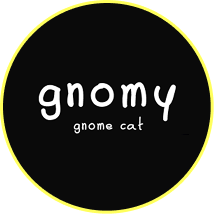

  <h1>Hello, I'm Nathan Chaput! </h1>

  <h2>🙋‍♂️ About Me</h2>

  

    🎓 Student in <b>BTS SIO SLAM</b> (Software Development, 2024–2026) 
    💻 Passionate about <b>modern web development</b> (Next.js, React, Tailwind, TypeScript) 
    🎨 Love to combine <b>design and code</b>, with a focus on <b>UI/UX</b> and <b>3D integration</b> (Blender, Three.js) 
    ⚡ Building projects from immersive websites to business apps (Electron, Laravel, SwiftUI) 
    🚀 Goal: becoming a <b>Front-End / Fullstack Developer</b> with a creative edge
  

---

  <h2>💻 My Projects</h2>

<table>
  <tr>
    <td>
      
       <b>Motocats</b> 🏍️ Front-end DEV
    </td>
    <td align="center">
      
       <b>Gnomy</b> 🧙 Front-end DEV
    </td>
  </tr>
</table>

---

  <h2>🛠️ Tech Stack</h2>
  

    
  

---

  <h2>📊 GitHub Stats</h2>
  
    
  

---

  <h2>🌐 Connect with Me</h2>
  
  
  

